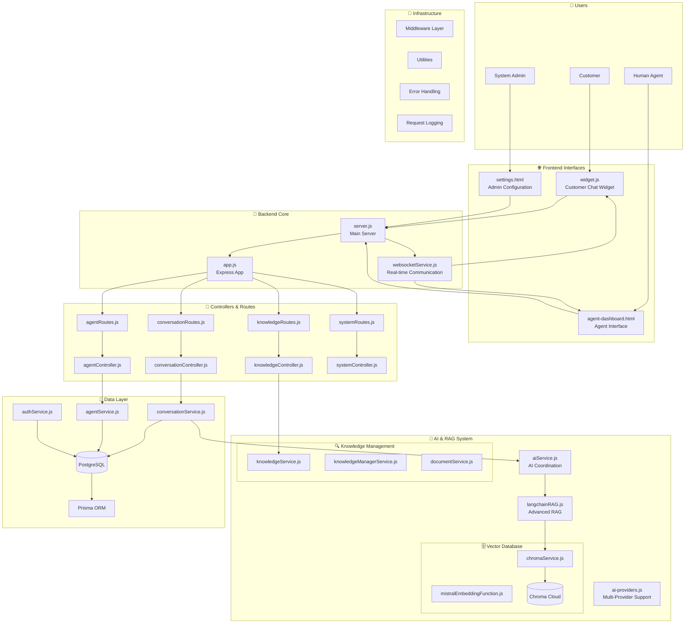
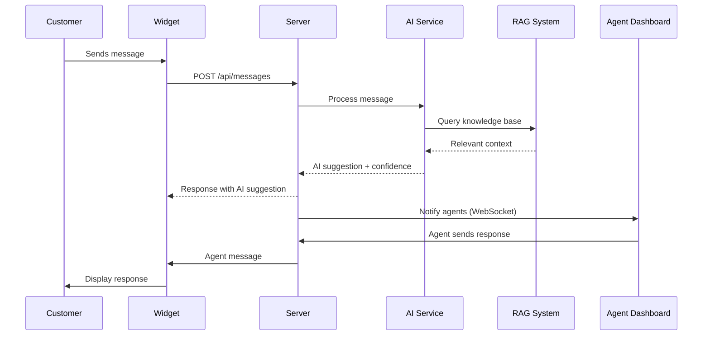
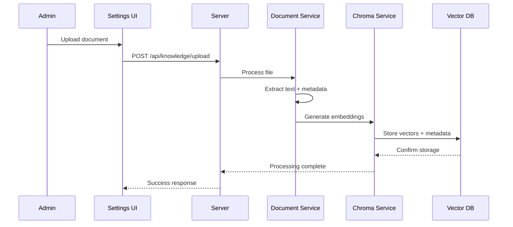

# Vilnius Assistant - Complete System Architecture

> Comprehensive architecture documentation covering system design, component interactions, and technical implementation details.

## 🏗️ System Overview

The Vilnius Assistant is a full-stack customer support platform with AI-powered chat capabilities, real-time agent dashboard, and advanced RAG (Retrieval-Augmented Generation) system.



---

## 📁 Directory Structure

```
vilnius-assistant/
├── custom-widget/
│   ├── 🎨 Frontend Files
│   │   ├── agent-dashboard.html          # Agent interface
│   │   ├── widget.js                     # Customer chat widget
│   │   ├── settings.html                 # Admin configuration
│   │   ├── login.html                    # Authentication
│   │   └── js/                           # Frontend JavaScript
│   │
│   ├── 🔧 Backend System
│   │   ├── server.js                     # Main server entry point
│   │   ├── ai-providers.js               # AI provider abstraction
│   │   ├── prisma/                       # Database schema & migrations
│   │   │   ├── schema.prisma
│   │   │   └── seed.js
│   │   │
│   │   ├── src/
│   │   │   ├── app.js                    # Express application setup
│   │   │   ├── controllers/              # Request handlers
│   │   │   │   ├── conversationController.js
│   │   │   │   ├── agentController.js
│   │   │   │   ├── authController.js
│   │   │   │   ├── knowledgeController.js
│   │   │   │   └── systemController.js
│   │   │   │
│   │   │   ├── services/                 # Business logic
│   │   │   │   ├── conversationService.js
│   │   │   │   ├── agentService.js
│   │   │   │   ├── aiService.js
│   │   │   │   ├── authService.js
│   │   │   │   ├── knowledgeService.js
│   │   │   │   ├── chromaService.js
│   │   │   │   ├── langchainRAG.js
│   │   │   │   └── websocketService.js
│   │   │   │
│   │   │   ├── routes/                   # API routes
│   │   │   │   ├── conversationRoutes.js
│   │   │   │   ├── agentRoutes.js
│   │   │   │   ├── authRoutes.js
│   │   │   │   └── knowledgeRoutes.js
│   │   │   │
│   │   │   ├── middleware/               # Express middleware
│   │   │   │   ├── authMiddleware.js
│   │   │   │   ├── errorHandler.js
│   │   │   │   └── requestLogger.js
│   │   │   │
│   │   │   └── utils/                    # Utilities
│   │   │       ├── database.js
│   │   │       ├── passwordUtils.js
│   │   │       ├── tokenUtils.js
│   │   │       └── validators.js
│   │   │
│   │   ├── tests/                        # Test suites
│   │   │   ├── setup.js
│   │   │   ├── unit/
│   │   │   └── integration/
│   │   │
│   │   └── uploads/                      # Document uploads
│   │
│   └── 📚 Documentation
│       ├── API_GUIDE.md
│       ├── DEVELOPER_GUIDE.md
│       ├── ARCHITECTURE.md (this file)
│       └── FILE_GUIDE.md
│
└── project/                              # Strategic documentation
    ├── README.md
    ├── current-system.md
    ├── migration-plan.md
    └── moonshot_spec.md
```

---

## 🏛️ Architecture Layers

### 1. Presentation Layer (Frontend)

#### **Customer Interface**
- **widget.js**: Embeddable chat widget for websites
- **Responsive design** for mobile and desktop
- **Real-time messaging** via WebSocket connection
- **Typing indicators** and message status

#### **Agent Interface**
- **agent-dashboard.html**: Real-time agent dashboard
- **Multi-conversation management** with queue system
- **AI suggestion integration** with edit/send options
- **Agent status management** (online/AFK)
- **Bulk operations** for conversation management

#### **Admin Interface**
- **settings.html**: System configuration and user management
- **Knowledge base management** with document upload
- **System monitoring** and health checks
- **User role management** and permissions

### 2. API Layer (Backend Routes & Controllers)

#### **Route Structure**
```javascript
// API endpoint organization
/api/
├── /conversations          # Conversation management
├── /messages              # Message handling
├── /agents               # Agent operations
├── /auth                 # Authentication
├── /knowledge            # Knowledge base
├── /admin               # Admin functions
├── /health              # System health
└── /docs                # API documentation
```

#### **Controller Responsibilities**
- **conversationController.js**: Conversation lifecycle management
- **agentController.js**: Agent dashboard data and operations
- **authController.js**: User authentication and authorization
- **knowledgeController.js**: Document and knowledge management
- **systemController.js**: System settings and health monitoring

### 3. Business Logic Layer (Services)

#### **Core Services**
- **conversationService.js**: Conversation data management and AI integration
- **agentService.js**: Agent status, assignment, and availability
- **aiService.js**: AI provider coordination and response generation
- **authService.js**: User authentication, JWT tokens, password management
- **knowledgeService.js**: Document processing and vector database management

#### **AI & RAG Services**
- **langchainRAG.js**: Advanced RAG implementation with LangChain
- **chromaService.js**: Vector database operations and embeddings
- **mistralEmbeddingFunction.js**: Mistral embedding generation

#### **Infrastructure Services**
- **websocketService.js**: Real-time communication management
- **documentService.js**: File upload and processing

### 4. Data Layer

#### **Database (PostgreSQL + Prisma)**
```sql
-- Core tables
users              # User authentication and profiles
tickets            # Customer support conversations
messages           # Individual conversation messages
agent_status       # Agent availability tracking
ticket_actions     # Audit log for conversation changes
refresh_tokens     # JWT refresh token management
user_activities    # User activity logging
system_settings    # Application configuration
```

#### **Vector Database (Chroma Cloud)**
```javascript
// Knowledge base storage
collections: {
  "vilnius-knowledge": {
    documents: "Text chunks from uploaded documents",
    embeddings: "Mistral embeddings for semantic search",
    metadata: "Document titles, categories, tags"
  }
}
```

---

## 🔄 Data Flow Patterns

### Customer Message Flow


### Document Processing Flow


---

## 🔧 Technical Implementation

### Authentication & Authorization
- **JWT-based authentication** with refresh tokens
- **Role-based access control** (admin, agent, customer)
- **Password hashing** with bcrypt
- **Session management** with secure token storage

### Real-time Communication
- **WebSocket connections** for instant messaging
- **Room-based communication** for conversation isolation
- **Agent presence tracking** and status updates
- **Typing indicators** and message acknowledgments

### AI Integration
- **Multi-provider support** (OpenRouter, Flowise)
- **RAG system** with semantic search
- **Confidence scoring** for AI suggestions
- **Fallback handling** for AI service failures

### Performance & Scalability
- **Connection pooling** for database operations
- **Efficient vector search** with optimized embeddings
- **Caching strategies** for frequent queries
- **Error handling** with graceful degradation

### Security Measures
- **Input validation** on all endpoints
- **SQL injection protection** via Prisma ORM
- **CORS configuration** for cross-origin requests
- **Rate limiting** (planned for production)
- **Secure file upload** with type validation

---

## 🚀 Deployment Architecture

### Development Environment
```yaml
Services:
  - Node.js Server (localhost:3002)
  - PostgreSQL Database (localhost:5432)
  - Chroma Cloud Vector DB
  - Frontend served statically
```

### Production Environment (Planned)
```yaml
Load Balancer:
  - NGINX reverse proxy
  - SSL termination
  
Application Tier:
  - Multiple Node.js instances
  - PM2 process management
  - Health check endpoints
  
Data Tier:
  - PostgreSQL with replication
  - Chroma Cloud vector database
  - Redis for session storage
  
Monitoring:
  - Application logs
  - Performance metrics
  - Error tracking
```

---

## 🔍 Monitoring & Observability

### Health Checks
- **Database connectivity** monitoring
- **AI service availability** checks
- **Vector database** connection status
- **Memory and CPU** usage tracking

### Logging Strategy
- **Request/response logging** with timestamps
- **Error tracking** with stack traces
- **User activity logging** for audit trails
- **Performance metrics** for optimization

### Error Handling
- **Centralized error handler** for consistent responses
- **Graceful degradation** when services are unavailable
- **User-friendly error messages** in Lithuanian/English
- **Automatic retry mechanisms** for transient failures

---

## 📈 Future Enhancements

### Scalability Improvements
- **Microservices architecture** for component isolation
- **Container deployment** with Docker/Kubernetes
- **Horizontal scaling** for high availability
- **Caching layer** with Redis

### Feature Additions
- **Multi-language support** beyond Lithuanian/English
- **Analytics dashboard** for conversation insights
- **Integration APIs** for external systems
- **Mobile applications** for agents

### Performance Optimizations
- **Database query optimization** with indices
- **Vector search performance** tuning
- **CDN integration** for static assets
- **Real-time metrics** collection and analysis

This architecture provides a solid foundation for a production-ready customer support platform with room for future growth and enhancement.