# Vilnius Assistant - System Architecture

This document provides visual diagrams explaining how the entire Vilnius Assistant chat widget system works, from user interactions to AI responses.

## 🏗️ Complete System Architecture


## 💬 Customer Conversation Flow


## 🤖 Agent Assistance Flow

```mermaid
sequenceDiagram
    participant A as Agent
    participant AD as Agent Dashboard
    participant WS as WebSocket
    participant AC as AgentController
    participant CC as ConvController
    participant AI as AIService

    Note over A,AI: Customer sends message first
    
    CC->>AI: Generate AI suggestion
    AI-->>CC: AI suggestion ready
    CC->>WS: Broadcast AI suggestion
    WS->>AD: Display suggestion panel
    AD->>A: Shows "Siųsti kaip yra" button
    
    alt Agent uses suggestion as-is
        A->>AD: Clicks "Siųsti kaip yra"
        AD->>WS: Send as-is request  
        WS->>AC: Process agent response
        AC->>CC: Send to customer
        CC->>WS: Deliver to customer
    else Agent edits suggestion
        A->>AD: Clicks "Redaguoti"
        AD->>A: Shows editable text
        A->>AD: Modifies response
        AD->>WS: Send modified response
        WS->>AC: Process agent response
        AC->>CC: Send to customer
    else Agent writes from scratch
        A->>AD: Clicks "Nuo pradžių"
        AD->>A: Shows empty text field
        A->>AD: Writes custom response
        AD->>WS: Send custom response
        WS->>AC: Process agent response
        AC->>CC: Send to customer
    end
```



## 📁 Document Upload & RAG Integration


## 🔄 Multi-Provider AI Architecture

```mermaid
graph LR
    subgraph "🎯 AI Coordination Layer"
        AS[aiService.js<br/>Main Coordinator]
    end
    
    subgraph "🔀 Provider Abstraction"
        AP[ai-providers.js<br/>Multi-Provider Support]
        FP[FlowiseProvider]
        OP[OpenRouterProvider]
    end
    
    subgraph "🧠 RAG Enhancement"
        LR[langchainRAG.js<br/>Advanced RAG]
    end
    
    subgraph "🌍 External AI Services"
        F[Flowise<br/>Built-in RAG]
        OR[OpenRouter<br/>+ External RAG]
    end

    AS --> AP
    AS --> LR
    AP --> FP
    AP --> OP
    FP --> F
    OP --> OR
    LR --> OR
    
    Note1[Provider switch via<br/>environment variable<br/>AI_PROVIDER=flowise|openrouter]
    
    style AS fill:#fff3e0
    style LR fill:#fff3e0
    style F fill:#e8f5e8
    style OR fill:#e8f5e8
```

## 🛠️ System Configuration Flow


## 🔍 Key System Features

### **Multi-Channel Communication**
- **Customer Widget**: Direct customer interaction
- **Agent Dashboard**: Real-time agent assistance with AI suggestions
- **Admin Panel**: System configuration and knowledge management

### **Advanced RAG (Retrieval-Augmented Generation)**
- **Query Rephrasing**: Converts ambiguous questions into searchable queries
- **Conversation Context**: Maintains multi-turn conversation awareness
- **Semantic Search**: Uses Mistral embeddings for relevant document retrieval
- **Bilingual Support**: Responds in Lithuanian or English based on input

### **Multi-Provider AI Support**
- **OpenRouter**: Gemini models with external RAG enhancement
- **Flowise**: Alternative AI provider with built-in RAG capabilities
- **Switchable**: Runtime provider switching via configuration

### **Real-Time Architecture**  
- **WebSocket Communication**: Instant message delivery
- **Live Agent Updates**: Real-time conversation monitoring
- **AI Suggestion System**: Immediate AI assistance for agents

This architecture provides a complete, scalable chat widget system with enterprise-level features for customer support, AI assistance, and knowledge management.