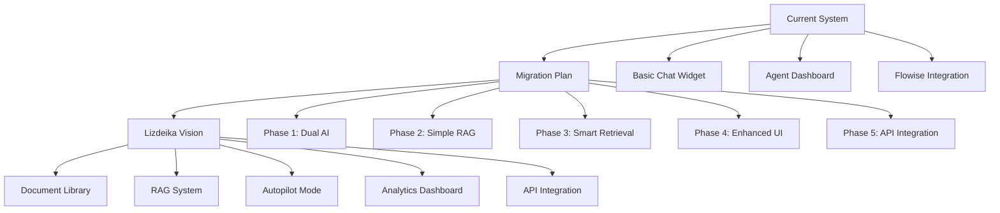

# Vilniaus Chatbot'as Project Documentation

This folder contains all documentation for the Vilnius city customer support system project, from its current state through its planned evolution to the full "Lizdeika" platform.

## Document Overview

### 📋 [moonshot_spec.md](./moonshot_spec.md)
**The Vision Document**

This is the complete specification for "Lizdeika" - the ultimate customer support system for Vilnius city. It describes:
- Full system requirements and features
- Technical architecture and implementation details  
- How all components work together
- Security and deployment requirements

**Key Features**: Autopilot/Assisted modes, Document library, RAG system, Analytics, API integrations

### 📊 [current-system.md](./current-system.md)  
**The Current State**

Detailed documentation of the existing "Vilniaus chatbot'as" system. It covers:
- Current architecture and components
- Working features and known limitations
- Technical specifications and performance
- Security profile and deployment process

**Current Status**: Basic chat widget + agent dashboard with Flowise AI integration

### 🗺️ [migration-plan.md](./migration-plan.md)
**The Journey Map**

A comprehensive, phased migration plan that bridges the gap between current system and Lizdeika vision. It outlines:
- 5 distinct migration phases with clear goals
- Risk-free approach that never breaks existing functionality
- Timeline estimates and success criteria
- Technical implementation strategy

**Philosophy**: Gradual enhancement with continuous backward compatibility

## Project Relationship

## How They Work Together

### 1. **The Vision** (moonshot_spec.md)
Defines the end goal - a complete customer support platform that can:
- Answer questions automatically (Autopilot) or with human assistance
- Learn from uploaded documents and external data sources  
- Provide analytics and reporting
- Integrate with external city systems
- Handle high volumes of citizen inquiries

### 2. **The Reality** (current-system.md)
Shows what we have today - a working but basic system that:
- Handles real-time conversations between citizens and agents
- Provides AI suggestions through Flowise integration
- Supports Lithuanian language throughout
- Works reliably for small-scale deployment
- Lacks persistence, document management, and advanced features

### 3. **The Bridge** (migration-plan.md)
Provides the step-by-step path to get from Reality to Vision by:
- Adding features incrementally without breaking anything
- Maintaining backward compatibility throughout
- Testing each phase independently
- Allowing rollback at any point
- Building confidence through gradual enhancement

## Migration Phases Summary

| Phase | Goal | Duration | Key Features Added |
|-------|------|----------|-------------------|
| **Phase 1** | Dual AI Support | 1-2 weeks | OpenRouter integration, System prompts |
| **Phase 2** | Simple RAG | 1 week | Document upload, Basic search |
| **Phase 3** | Smart Retrieval | 2-3 weeks | Embeddings, Semantic search |
| **Phase 4** | Enhanced UI | 2 weeks | Autopilot mode, Document management |
| **Phase 5** | API Integration | 2-3 weeks | External APIs, iframe embedding |

## Current Status

- ✅ **System Running**: Basic chat system operational at `http://localhost:3002`
- ✅ **Documentation Complete**: All three documents created and aligned
- 🔄 **Ready for Phase 1**: OpenRouter integration can begin
- 📋 **Migration Plan Approved**: Waiting for implementation decision

## Next Steps

1. **Review all documents** to ensure alignment with project goals
2. **Approve migration approach** and phase prioritization  
3. **Set up development environment** for Phase 1 implementation
4. **Begin Phase 1**: Dual AI Backend Support
5. **Establish testing procedures** for each migration phase

